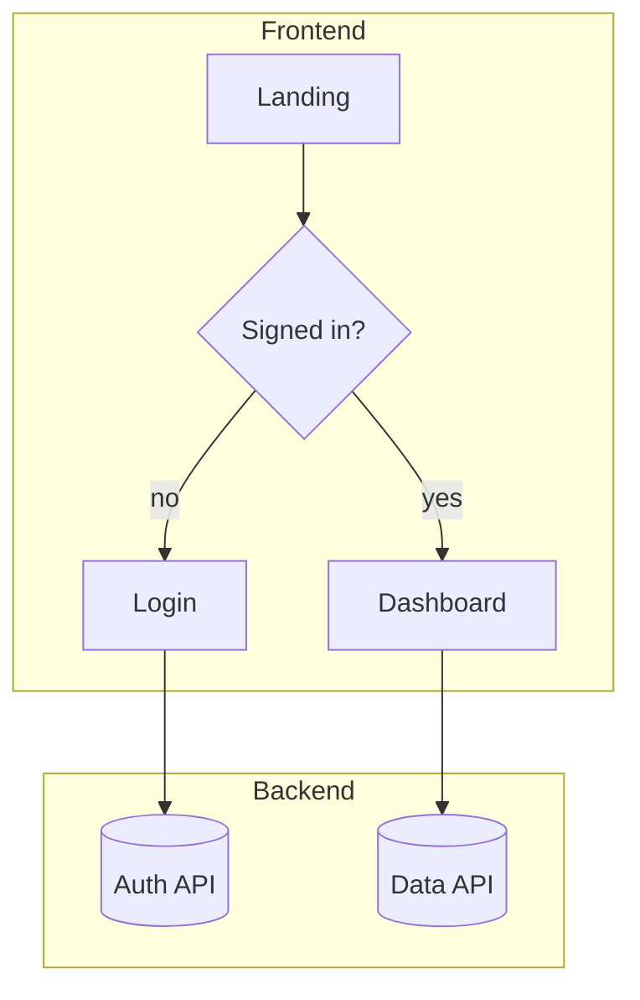

# Journey Mapping — the full UI/UX flow

Map the end-to-end journey across frontend AND backend: screens, states, user decisions, and the
backend calls/events behind each step. This is the bridge between *what* (PRD) and *how* (stack,
modules, build). Run at the frontier model for quality (the `ui-ux-designer` agent).

## Fits in the pipeline
- **Stage 2** (`/journey`). Input: the approved PRD. Output: an approved journey the architect
  uses for Stage 3 (stack) and Stage 4 (modules). Owned by `ui-ux-designer`.

## The auto-switch rule (Mermaid vs interactive canvas)
Pick the representation by complexity — don't make the user ask:

- **Simple journey → Mermaid diagram.** Few screens, mostly linear, limited branching. Render a
  Mermaid `flowchart` inline. Fast, diffable, version-controllable.
- **Complex journey → interactive local canvas.** Many nodes, heavy branching, parallel flows,
  multiple personas, or a graph that's unreadable as static text. Switch to the drag-and-drop
  canvas so the user can rearrange steps, add comments, connect nodes, and insert sections.

**Heuristic for "complex":** roughly > 12–15 nodes, OR > 3 branch points, OR multiple personas
with crossing paths, OR the user is iterating heavily on layout. When in doubt, start in Mermaid
and offer to promote to the canvas — state the switch and why.

## Interactive canvas (built — launch it for complex journeys)
A dependency-free local Node server + drag-and-drop canvas ships with this skill at
`${CLAUDE_PLUGIN_ROOT}/skills/journey-mapping/canvas/`. It persists the journey to a JSON file
the agent reads back, so the user can rearrange steps, edit labels/notes, connect nodes, and
**insert a step on any edge**.

**Launch:**
```bash
node "${CLAUDE_PLUGIN_ROOT}/skills/journey-mapping/canvas/server.mjs" [path/to/journey.json]
# then open http://localhost:4521  (override with --port or JOURNEY_CANVAS_PORT)
```
- If no path is given it reads/writes `.journey-canvas-state.json` in the project dir (gitignored).
- **JSON shape** (the seed you generate AND what the agent reads after the user saves):
  `{ "title": str, "nodes": [{ "id","label","type":"ui|backend|module","x","y","comment" }],
    "edges": [{ "from","to","label" }] }`.

**Workflow:** for a complex journey, generate the `journey.json` seed from the PRD, write it,
launch the server, and ask the user to arrange/annotate and Save. Then READ the saved JSON back
and treat it as the approved journey. Always also keep a Mermaid rendering in the repo for
diffability. For simple journeys, skip the canvas and use Mermaid only.

### Mermaid shape to use

Label backend touchpoints distinctly (DB, API, queue, external service) so the journey shows both
layers. Every PRD requirement should appear somewhere in the journey — flag any that don't (a gap).

## Gate
◆ The user approves or improves the journey before Stage 3. Capture their edits back into the
Mermaid (or the JSON seed) so downstream stages read the approved version.
