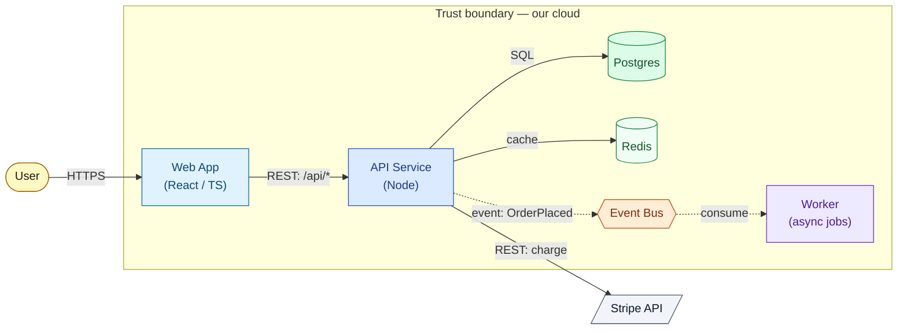

# VibeGod C4 Mermaid convention — one visual language for every architecture diagram

The shared standard so the **platform-blueprint** (C4 Container view) and **module-architecture**
(module-boundary graph) diagrams look and read the same everywhere. Mermaid is chosen on purpose:
it renders **read-only, for free, inside GitHub PRs, IDEs, and docs** — exactly where architecture is
reviewed. **Commit the diagram inside the blueprint / module-map markdown** (a fenced ```mermaid```
block), never as a side file nobody opens.

## Rules (keep every diagram consistent and readable)
1. **One Container/module diagram is required** — not optional. Use `flowchart LR`.
2. **Shapes carry meaning** (so the diagram is scannable without reading every label):
   | Type | Mermaid shape | classDef |
   |---|---|---|
   | Person / actor | stadium `([User])` | `:::actor` |
   | App / service / worker (a runnable container) | rectangle `["API"]` | `:::webapp` · `:::api` · `:::worker` |
   | Datastore / cache | cylinder `[("Postgres")]` | `:::datastore` · `:::cache` |
   | Queue / event bus | hexagon `{{"Bus"}}` | `:::queue` |
   | External system (3rd-party) | parallelogram `[/"Stripe"/]` | `:::external` |
3. **Every edge is labeled `mechanism: contract`** — `HTTPS`, `REST: /api/*`, `gRPC`, `SQL`,
   `cache`, `event: OrderPlaced`. **Async/eventing is dashed** (`-.->`); synchronous is solid (`-->`).
   An unlabeled arrow is a defect.
4. **Trust boundary = a `subgraph`** wrapping the in-perimeter containers. The `security-engineer`
   reads this: anything crossing the boundary is an attack surface.
5. **Size discipline:** ≤ ~10–12 boxes. Denser → split by bounded context into multiple diagrams.
   (Same readability rule the journey canvas enforces — a 50-node wall communicates nothing.)
6. **The `classDef` block is the legend** — always include it (colors below are light-theme tuned to
   match the journey canvas). Add a one-line `%%` comment naming the view.

## Copy-paste starter (a valid Container diagram — adapt the nodes/edges, keep the conventions)


## For the module-architecture boundary diagram (Stage 4)
Same language, different nouns: nodes are **modules** (use `:::api` for service-like modules,
`:::datastore` for data-owning ones, `:::external` for 3rd-party), edges are the **contracts** from
the module map (`REST`/`event`/`gRPC` + the endpoint/event name), dashed for async. Wrap any modules
inside a trust boundary in a `subgraph`. Every PRD requirement/journey step must land in exactly one
module node — so the diagram doubles as the no-orphans check.

## Why read-only (and what this is NOT)
This is deliberately a **rendered, committed diagram**, not an interactive editor. A drag-and-drop
canvas for architecture was considered and rejected: architecture is authored ~once, the load-bearing
detail (ADRs/NFRs/contracts) is prose, and a `file://` canvas doesn't render in PRs. If interactive
authoring is ever genuinely needed, the path is generalizing the journey canvas — a separate decision.
