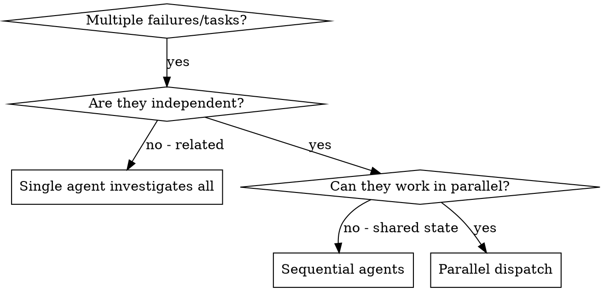

<!-- Adapted from superpowers (https://github.com/obra/superpowers), MIT (c) Jesse Vincent. -->

# Dispatching Parallel Agents

## Overview

You delegate to specialized agents with isolated context, crafting exactly the instructions and context each needs (never your session history). This keeps them focused and preserves your context for coordination.

When you have multiple unrelated problems (different test files, subsystems, bugs), investigating sequentially wastes time. Each is independent and can happen in parallel.

**Core principle:** Dispatch one agent per independent problem domain. Let them work concurrently.

## Fits in the pipeline

Powers the **coding swarm in Stage 6 (Build)** — FE/BE/data/infra agents working independent modules at once — and parallel defect triage feeding the **Stage 7 per-feature QA gate**. Pair with `using-git-worktrees` so parallel agents don't collide on the same files, and `subagent-driven-development` for per-task review within a domain. Priority: **user > skills > default**; `_shared/vibegod-principles.md` apply.

## When to Use



**Use when:** 3+ test files failing with different root causes; multiple subsystems broken/built independently; each problem understandable without context from others; no shared state.

**Don't use when:** failures are related (fixing one might fix others — investigate together first); you need full system state; agents would interfere (same files/resources); you don't yet know what's broken (exploratory).

## The Pattern

1. **Identify independent domains.** Group by what's broken/built (File A: tool approval; File B: batch completion; File C: abort). Each is independent.
2. **Create focused agent tasks.** Each gets: specific scope (one file/subsystem), clear goal, constraints (don't touch other code), expected output (summary of what was found and changed). Give them worktree isolation when they write to disk concurrently.
3. **Dispatch in parallel.** One agent per domain, concurrently.
4. **Review and integrate.** Read each summary, verify fixes don't conflict, run the full test suite, integrate.

## Agent Prompt Structure

Good agent prompts are **focused** (one domain), **self-contained** (all context to understand the problem), and **specific about output**.

```markdown
Fix the 3 failing tests in src/agents/agent-tool-abort.test.ts:

1. "should abort tool with partial output capture" — expects 'interrupted at' in message
2. "should handle mixed completed and aborted tools" — fast tool aborted instead of completed
3. "should properly track pendingToolCount" — expects 3 results but gets 0

These are timing/race-condition issues. Your task:
1. Read the test file; understand what each test verifies.
2. Identify root cause — timing or actual bug?
3. Fix by replacing arbitrary timeouts with event-based waiting; fix real bugs if found.

Do NOT just increase timeouts — find the real issue. Do NOT change production code outside this domain.
Return: summary of root cause and what you changed.
```

## Common Mistakes

- **Too broad** ("Fix all the tests") → agent gets lost. **Specific** ("Fix agent-tool-abort.test.ts").
- **No context** ("Fix the race condition") → agent doesn't know where. **Paste** the error messages and test names.
- **No constraints** → agent refactors everything. **Constrain** ("Fix tests only" / "Don't change production code").
- **Vague output** ("Fix it") → you don't know what changed. **Specific** ("Return root cause and changes").

## Verification

After agents return: review each summary; check for conflicts (did agents edit the same code?); run the full suite (verify fixes work together); spot-check (agents can make systematic errors). Use `verification-before-completion` before claiming the batch is done.

## Key Benefits

Parallelization (concurrent investigations), focus (narrow scope per agent), independence (no interference), speed (N problems solved in the time of one).

## Scaling out: multiple agent swarms

One swarm = a handful of agents on one set of independent work. When the build is too big for a
single swarm (many independent modules/services, or several disciplines working at once), **fan out
into multiple concurrent swarms** — the same independence rule, one level up.

**Who decides, and how to partition:** the `vibegod-orchestrator` + `delivery-manager` (TPM) choose the
partition **per build** from the dependency graph and the scale — there is no fixed rule. Common cuts:
one swarm **per module/service** (default for foundation-first builds with frozen contracts), or one
**per discipline/workstream** (frontend/backend/data) coordinated by the department leads. Pick
whichever yields the most genuinely independent lanes for this build.

**Rules for spinning up more swarms (do NOT skip these):**
- **Foundation first.** Never fan out across the shared foundation or unfrozen contracts — stabilize
  the base, freeze the interfaces, THEN parallelize the independent work that sits on top.
- **Independence still required.** Only split work with no shared state / no sequential dependency
  between swarms — the same test as for parallel agents, scaled up. Dependent work stays sequential.
- **Isolate.** Each swarm runs in its own git worktree (`using-git-worktrees`) so swarms never collide.
- **Bound concurrency.** Cap simultaneous swarms to what the dependency graph AND review capacity
  allow; queue the rest. More swarms than you can integrate/review is slower, not faster.
- **Track as workstreams.** `delivery-manager` logs each swarm in the **RAID log** (owner, cross-swarm
  dependencies, status) and escalates any cross-swarm blocker.
- **Reconcile at the seams.** Integrate swarm outputs at the shared contracts/interfaces; every feature
  still passes the **Stage 7 QA gate** (incl. the consistency/no-orphans check). Resolve conflicts at
  module boundaries, not by letting one swarm reach into another's lane.

