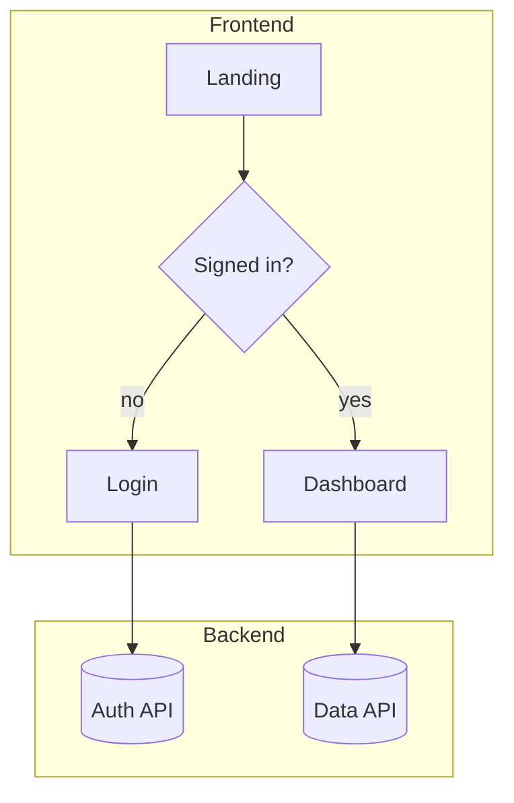

# Journey Mapping — the full UI/UX flow

Map the end-to-end journey across frontend AND backend: screens, states, user decisions, and the
backend calls/events behind each step. This is the bridge between *what* (PRD) and *how* (stack,
modules, build). Run at the frontier model for quality (the `ui-ux-designer` agent).

## Fits in the pipeline
- **Stage 2** (`/journey`). Input: the approved PRD. Output: an approved journey the architect
  uses for Stage 3 (stack) and Stage 4 (modules). Owned by `ui-ux-designer`.

## The auto-switch rule (Mermaid vs interactive canvas)
Pick the representation by complexity — don't make the user ask:

- **Simple journey → Mermaid diagram.** Few screens, mostly linear, limited branching. Render a
  Mermaid `flowchart` inline. Fast, diffable, version-controllable.
- **Complex journey → interactive local canvas.** Many nodes, heavy branching, parallel flows,
  multiple personas, or a graph that's unreadable as static text. Switch to the drag-and-drop
  canvas so the user can rearrange steps, add comments, connect nodes, and insert sections.

**Heuristic for "complex":** roughly > 12–15 nodes, OR > 3 branch points, OR multiple personas
with crossing paths, OR the user is iterating heavily on layout. When in doubt, start in Mermaid
and offer to promote to the canvas — state the switch and why.

## Readability rules — a journey is a human approval gate, not a data dump
The Stage-2 gate is a **person** (often non-technical) approving the flow in ~5 minutes. A 60-node
graph on one plane defeats that. Generate for read-at-a-glance:
- **Happy path first, ≤ ~12 boxes.** Show the one primary success flow. More than that means you're
  putting detail on the main plane that should be collapsed.
- **Plain-language labels.** "Send to AI", "Charge card", "Show receipt" — **never** technical ids like
  `b_ai_trigger`. The internal id lives in the `id` field; the `label` is what a stakeholder reads.
- **Swimlanes.** Put every node in a lane (e.g. User / App-UI / Backend-AI / Data) so who-does-what is obvious.
- **Collapse the noise.** Error / loading / empty / permission-denied / edge states are `level:"detail"`
  with a `parent` — they sit **collapsed under their step** and expand on demand (progressive disclosure),
  never cluttering the main plane.
- Bias to **clarity over completeness** — the detail is still in the file, just one click away.

## Journey JSON schema (v2)
```jsonc
{ "title": "string",
  "lanes": [ { "id": "user", "label": "User" }, { "id": "ui", "label": "App / UI" } ],
  "nodes": [ { "id": "n1", "label": "Send to AI",        // label = plain language, never a technical id
               "lane": "ui",
               "kind": "step|decision|error|loading|empty",   // default "step"
               "level": "happy|detail",                       // default "happy"; "detail" = collapsed under parent
               "parent": "n1|null",                           // detail states link to their happy step
               "comment": "string" } ],                       // x/y optional drag overrides — omit for auto-layout
  "edges": [ { "from": "n1", "to": "n2", "label": "submit" } ] }
```

## Interactive canvas (static single-file HTML — NO server)
Ships at `${CLAUDE_PLUGIN_ROOT}/skills/journey-mapping/canvas/journey-canvas.html` — a self-contained,
dependency-free HTML file. **There is no server and nothing to keep alive** (the old Node server died the
moment the launching subagent returned; that whole class of failure is gone). It renders swimlanes, shows
the happy path by default with detail states collapsed (progressive disclosure), and supports drag/reorder,
relabel, comment, connect, add/remove, and keyboard navigation.

**Workflow (complex journeys):**
1. Generate the journey JSON per the **readability rules** above (happy-path ≤12, swimlanes, plain labels,
   error/loading/empty states as `level:"detail"` under their `parent`).
2. Read the template, replace the single `__JOURNEY_DATA__` token (inside the `journey-data` script block)
   with your JSON, and **Write the result to `journey.html` in the project root.**
3. Tell the user to **open `journey.html`** in a browser (double-click / `file://`) and arrange/redline it.
4. **Read-back:** the user clicks **Copy JSON** and pastes it into the chat. Treat that pasted JSON as the
   approved journey — there is no file to read and no server to query.
5. **Always also write a happy-path Mermaid snapshot** (`journey.mmd` or inline) so the journey is diffable
   and version-controlled.

For simple journeys, skip the canvas and use Mermaid only (below).

### Mermaid shape to use

Label backend touchpoints distinctly (DB, API, queue, external service) so the journey shows both
layers. Every PRD requirement should appear somewhere in the journey — flag any that don't (a gap).

## Gate
◆ The user approves or improves the journey before Stage 3. Capture their edits back into the
Mermaid (or the JSON seed) so downstream stages read the approved version.
