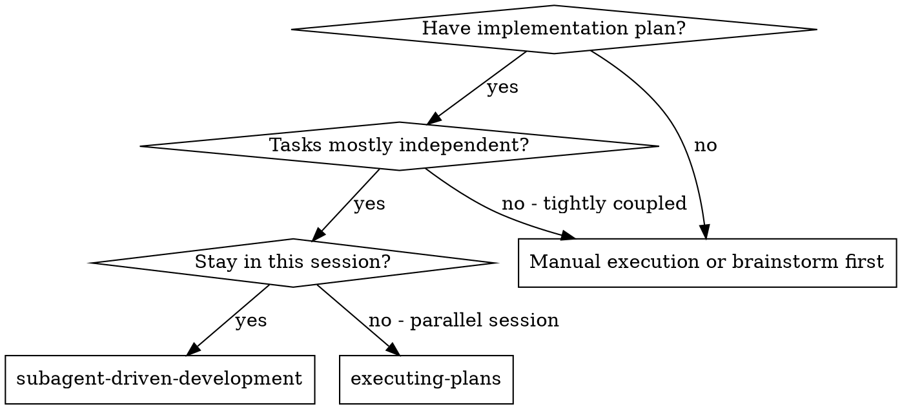

<!-- Adapted from superpowers (https://github.com/obra/superpowers), MIT (c) Jesse Vincent. -->

# Subagent-Driven Development

Execute a plan by dispatching a fresh subagent per task, with two-stage review after each: spec compliance first, then code quality.

**Why subagents:** you delegate to specialized agents with isolated context. By precisely crafting their instructions you keep them focused and preserve your own context for coordination. They never inherit your session history — you construct exactly what they need.

**Core principle:** Fresh subagent per task + two-stage review (spec then quality) = high quality, fast iteration.

**Continuous execution:** Do NOT pause to check in between tasks. Execute all tasks. Only stop for: an unresolvable BLOCKED status, genuine ambiguity, or completion. "Should I continue?" prompts waste the user's time — they asked you to execute the plan.

## Fits in the pipeline

This is the default execution engine for **Stage 6 (Build, `/build`)**. It pairs with `dispatching-parallel-agents` (for independent domains across worktrees), `using-git-worktrees` (isolation), and `requesting-code-review` (the reviewer subagents). Each task's reviews feed naturally into the **Stage 7 per-feature QA gate**. Priority: **user > skills > default**; `_shared/vibegod-principles.md` apply (subagents follow TDD and surgical-change rules).

## When to Use

## The Process

1. **Read the plan once.** Extract ALL tasks with full text and context. Create a TodoWrite list.
2. **Per task:**
   - Dispatch an **implementer subagent** with the full task text + scene-setting context (where it fits). Never make the subagent read the plan file — provide the text.
   - If it asks questions, answer completely before it proceeds.
   - It implements (TDD), tests, commits, self-reviews.
   - Dispatch a **spec-compliance reviewer** — confirms the code matches the spec, nothing missing, nothing extra. Issues → implementer fixes → re-review until ✅.
   - **Only after spec ✅**, dispatch a **code-quality reviewer**. Issues → implementer fixes → re-review until approved.
   - Mark the task complete in TodoWrite.
3. **After all tasks:** dispatch a final code reviewer for the whole implementation, then use `finishing-a-development-branch`.

## Model Selection

Use the least powerful model that can handle each role (cost + speed).
- **Mechanical** (isolated functions, clear spec, 1-2 files) → fast, cheap model. Most well-specified tasks are mechanical.
- **Integration/judgment** (multi-file, pattern matching, debugging) → standard model.
- **Architecture/design/review** → most capable available model.

## Handling Implementer Status

- **DONE** → proceed to spec review.
- **DONE_WITH_CONCERNS** → read concerns first. Correctness/scope concerns: address before review. Observations ("file getting large"): note and proceed.
- **NEEDS_CONTEXT** → provide the missing context, re-dispatch.
- **BLOCKED** → assess: context problem → add context, re-dispatch same model; needs more reasoning → re-dispatch a more capable model; too large → break into smaller pieces; plan itself wrong → escalate to the user.

**Never** ignore an escalation or force the same model to retry without changes.

## Red Flags

**Never:**
- Start implementation on main/master without explicit user consent.
- Skip reviews (spec OR quality), or start code-quality review before spec is ✅ (wrong order).
- Proceed with unfixed issues, or accept "close enough" on spec compliance.
- Dispatch multiple implementer subagents in parallel on the same files (conflicts — use `dispatching-parallel-agents` + worktrees for truly independent domains).
- Make a subagent read the plan file (provide full text).
- Skip scene-setting context, ignore subagent questions, or let self-review replace actual review.
- Move to the next task while either review has open issues.

**If a reviewer finds issues:** the same implementer subagent fixes them; reviewer re-reviews; repeat until approved. **If a subagent fails:** dispatch a fix subagent with specific instructions — don't fix manually (context pollution).

## Integration

**Required workflow skills:** `using-git-worktrees` (isolation), `writing-plans` (creates the plan), `requesting-code-review` (reviewer template), `finishing-a-development-branch` (after all tasks).
**Subagents use:** `test-driven-development` per task.
**Alternative:** `executing-plans` for parallel-session / no-subagent execution.
