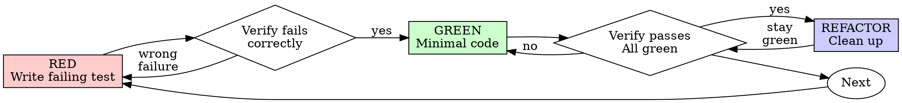

<!-- Adapted from superpowers (https://github.com/obra/superpowers), MIT (c) Jesse Vincent. -->

# Test-Driven Development (TDD)

## Overview

Write the test first. Watch it fail. Write minimal code to pass.

**Core principle:** If you didn't watch the test fail, you don't know if it tests the right thing.

**Violating the letter of the rules is violating the spirit of the rules.**

## Fits in the pipeline

TDD is the spine of **Stage 6 (Build)** and the **Stage 5 build plan** is written in TDD steps. The Stage 7 per-feature QA gate and Stage 8 ship gate refuse to advance without green tests. Priority: **user > skills > default**; `_shared/vibegod-principles.md` apply (#8 quality bar: no merge/ship without green; evidence-based completion only).

## When to Use

**Always:** new features, bug fixes, refactoring, behavior changes.

**Exceptions (ask the user):** throwaway prototypes, generated code, configuration files.

Thinking "skip TDD just this once"? Stop. That's rationalization.

## The Iron Law

```
NO PRODUCTION CODE WITHOUT A FAILING TEST FIRST
```

Wrote code before the test? Delete it. Start over.

**No exceptions:** don't keep it as "reference", don't "adapt" it while writing tests, don't look at it. Delete means delete. Implement fresh from tests.

## Red-Green-Refactor



### RED — Write Failing Test

One minimal test showing what should happen. Clear name, real behavior, one thing.

<Good>
```typescript
test('retries failed operations 3 times', async () => {
  let attempts = 0;
  const operation = () => {
    attempts++;
    if (attempts < 3) throw new Error('fail');
    return 'success';
  };
  const result = await retryOperation(operation);
  expect(result).toBe('success');
  expect(attempts).toBe(3);
});
```
</Good>

<Bad>
```typescript
test('retry works', async () => {
  const mock = jest.fn().mockRejectedValueOnce(new Error())
    .mockRejectedValueOnce(new Error()).mockResolvedValueOnce('success');
  await retryOperation(mock);
  expect(mock).toHaveBeenCalledTimes(3);
});
```
Vague name, tests the mock not the code.
</Bad>

**Requirements:** one behavior, clear name, real code (no mocks unless unavoidable).

### Verify RED — Watch It Fail

**MANDATORY. Never skip.** Run the test. Confirm it fails (not errors), the message is expected, and it fails because the feature is missing (not a typo).

- **Passes?** You're testing existing behavior. Fix the test.
- **Errors?** Fix the error, re-run until it fails correctly.

### GREEN — Minimal Code

Simplest code to pass. Don't add features, refactor other code, or "improve" beyond the test (principle #2). YAGNI on options/config you weren't asked for.

### Verify GREEN — Watch It Pass

**MANDATORY.** Run the test. Confirm it passes, other tests still pass, output is pristine (no errors/warnings). Test fails? Fix code, not test. Other tests fail? Fix now.

### REFACTOR — Clean Up

After green only: remove duplication, improve names, extract helpers. Keep tests green; don't add behavior.

### Repeat

Next failing test for the next behavior.

## Why Order Matters

- **"I'll write tests after to verify it works"** — tests-after pass immediately, proving nothing. They might test the wrong thing, test implementation not behavior, or miss edge cases. You never saw it catch the bug.
- **"I already manually tested the edge cases"** — manual is ad-hoc: no record, can't re-run, easy to forget under pressure.
- **"Deleting X hours of work is wasteful"** — sunk cost. The waste is keeping code you can't trust.
- **"TDD is dogmatic; pragmatic means adapting"** — TDD IS pragmatic: catches bugs before commit, prevents regressions, documents behavior, enables refactoring. Shortcuts = debugging in production = slower.
- **"Tests after achieve the same goals — spirit not ritual"** — no. Tests-after answer "what does this do?" Tests-first answer "what should this do?" Tests-after are biased by your implementation.

## Common Rationalizations

| Excuse | Reality |
|--------|---------|
| "Too simple to test" | Simple code breaks. Test takes 30 seconds. |
| "I'll test after" | Tests passing immediately prove nothing. |
| "Tests after achieve same goals" | After = "what does this do?" First = "what should this do?" |
| "Already manually tested" | Ad-hoc ≠ systematic. No record, can't re-run. |
| "Deleting X hours is wasteful" | Sunk cost. Unverified code is technical debt. |
| "Keep as reference" | You'll adapt it. That's testing after. Delete means delete. |
| "Need to explore first" | Fine — throw away the exploration, start with TDD. |
| "Test hard = ?" | Hard to test = hard to use. Listen to the test. |
| "TDD will slow me down" | TDD is faster than debugging. |

## Red Flags — STOP and Start Over

Code before test · test after implementation · test passes immediately · can't explain why it failed · tests added "later" · "just this once" · "already manually tested" · "spirit not ritual" · "keep as reference" · "already spent X hours" · "TDD is dogmatic" · "this is different because...".

**All of these mean: delete code, start over with TDD.**

## Verification Checklist

Before marking work complete:
- [ ] Every new function/method has a test
- [ ] Watched each test fail before implementing
- [ ] Each failed for the expected reason (feature missing, not a typo)
- [ ] Wrote minimal code to pass each
- [ ] All tests pass; output pristine (no errors/warnings)
- [ ] Tests use real code (mocks only if unavoidable)
- [ ] Edge cases and errors covered

Can't check all boxes? You skipped TDD. Start over.

## When Stuck

| Problem | Solution |
|---------|----------|
| Don't know how to test | Write the wished-for API / the assertion first. Ask the user. |
| Test too complicated | Design too complicated. Simplify the interface. |
| Must mock everything | Code too coupled. Use dependency injection. |
| Test setup huge | Extract helpers. Still complex? Simplify design. |

## Debugging Integration

Bug found? Write a failing test reproducing it, then follow the cycle. The test proves the fix and prevents regression. Never fix bugs without a test. (See `systematic-debugging` for root-cause first.)

## Final Rule

```
Production code → test exists and failed first
Otherwise → not TDD
```

No exceptions without the user's permission.
